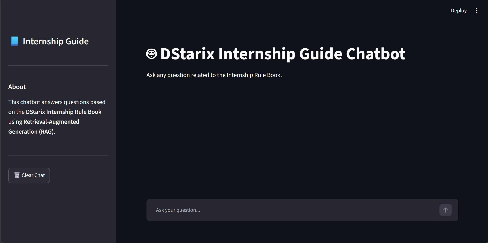
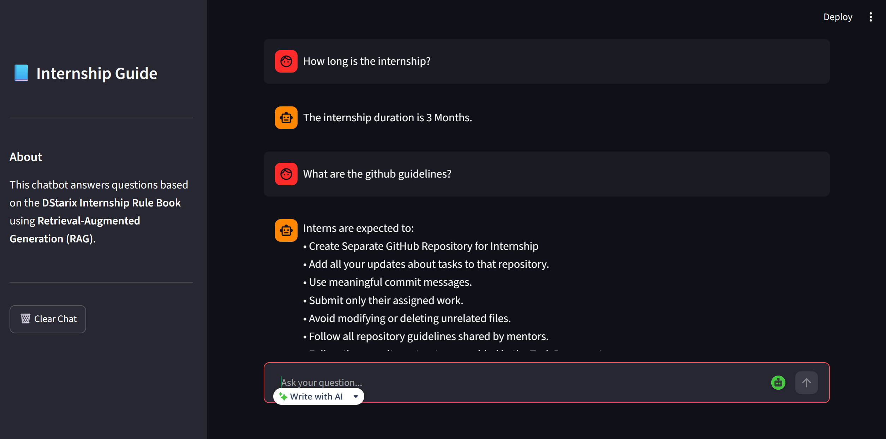

# DStarix Internship Guide RAG Chatbot

---

## 📝 Project Description
The **DStarix Internship Guide RAG Chatbot** is a Retrieval-Augmented Generation (RAG) system designed to assist DStarix interns. By analyzing the **DStarix Internship Rule Book PDF**, the chatbot retrieves context-accurate information to answer queries regarding rules, duration, flexible hours, GitHub practices, AI tool limits, evaluation criteria, and completion certificate requirements. It comes with both an elegant **Streamlit Web UI** and a lightweight **CLI Chat Client**.

---

## ✨ Features
- **Retrieval-Augmented Generation (RAG)**: Retrieves specific sections from the PDF to answer questions accurately and avoid hallucinations.
- **Strict Grounding**: Instructed to only answer from the provided context and gracefully fail if information is not found.
- **Local-First Embedding Caching**: Saves bandwidth and avoids network latency/SSL handshake issues by loading model weights locally.
- **User-Friendly Web Interface**: Built with Streamlit, containing chat history, responsive sidebar, developer information, and clear actions.
- **Terminal CLI Client**: Quick and light terminal-based interactive chat interface.
- **Windows-Optimized Asyncio**: Built-in support for Windows network event loops.

---

## 📸 Screenshots

### Web Interface Home Page


### Sample Questions & Answers


---

## 🛠️ Technologies Used
- **Orchestration**: LangChain
- **LLM**: Groq API (`llama-3.3-70b-versatile`)
- **Embeddings**: HuggingFace Embeddings (`sentence-transformers/all-MiniLM-L6-v2`)
- **Vector Database**: FAISS (Facebook AI Similarity Search)
- **Frontend / UI**: Streamlit
- **Environment & Config**: Python-dotenv, PyPDF

---

## 📥 Installation Instructions

### 1. Clone the Repository
Clone the repository to your local machine:
```bash
git clone https://github.com/Samyuktha13-06/week3_rag_internship_guide_chatbot.git
cd week3_rag_internship_guide_chatbot
```

### 2. Set Up a Virtual Environment
Create and activate a Python virtual environment:
```powershell
# Windows PowerShell
python -m venv venv
venv\Scripts\activate
```

### 3. Install Dependencies
Install all required packages from `requirements.txt`:
```bash
pip install -r requirements.txt
```

---

## ⚙️ Setup Instructions

### 1. Set Up Environment Variables
Create a `.env` file in the root directory (you can copy and rename `.env.example`) and fill in your Groq API Key:
```env
GROQ_API_KEY=gsk_your_actual_groq_api_key_here
```

### 2. Verify Data Source
Ensure the rule book is placed in the data directory:
`data/Internship Rule Book.pdf`

---

## 📖 Usage Guide

### Running the Web App (Streamlit)
To start the Streamlit web server, run:
```bash
streamlit run app.py
```
This will automatically open the application in your default browser at `http://localhost:8501`.

### Running the CLI Chat App
To run the lightweight chat application directly inside your terminal, run:
```bash
python cli_chat.py
```
Type your query and press Enter. To exit the program, type `exit` or `quit`.

### Running Verification Tests
To run quick pipeline verification scripts:
```bash
python test_rag.py
```

---

## 📂 Project Structure

Here is the directory structure of the project:

```
rag_chatbot/
├── assets/                    # Project assets
│   └── screenshots/           # Home page and query screenshots
├── data/                      # Input document data sources
│   └── Internship Rule Book.pdf
├── embeddings/                # Embeddings loading modules
│   └── embedding_model.py
├── loaders/                   # PDF parsing & loading
│   └── document_loader.py
├── prompts/                   # Prompt template definitions
│   └── rag_prompt.py
├── rag/                       # RAG Chain orchestration
│   └── rag_chain.py
├── retriever/                 # Vector retrieval configurations
│   └── retriever.py
├── splitters/                 # Chunk splitting settings
│   └── text_splitter.py
├── utils/                     # Shared utilities (LLM creation)
│   └── llm.py
├── vectorstore/               # FAISS indices
│   ├── faiss_db.py
│   └── faiss_index/           # Serialized index and pickle files
│       ├── index.faiss
│       └── index.pkl
├── app.py                     # Streamlit application entry point
├── cli_chat.py                # Terminal interactive chat client
├── requirements.txt           # Python library dependencies list
├── sample_questions.md        # List of sample testing questions
└── test_rag.py                # RAG chain testing verification script
```

---

## ⚙️ Detailed Explanation of Features

### 1. Retrieval-Augmented Generation (RAG) Workflow
The chatbot connects queries to the internship rules using RAG:
- **Document Loading & Chunking**: The system parses `Internship Rule Book.pdf`, splitting it into semantic fragments using LangChain's text splitters to preserve contextual readability.
- **Vector Embedding & Storage**: Converts each text chunk into a 384-dimensional vector using `sentence-transformers/all-MiniLM-L6-v2` and persists it locally inside a FAISS vector store.
- **Semantic Retrieval**: At query time, the system retrieves the top 3 most semantically similar chunks relevant to the user's question, passing them to the language model as context.

### 2. Strict Prompt Grounding
The RAG system enforces safety constraints in prompt instructions:
- Restricts the model to answering queries **only** using the retrieved rule book context.
- Disables model hallucinations and external data reference.
- Custom fallback response: If the answer is not contained in the rules, the model replies exactly with: *"I couldn't find that information in the Internship Rule Book."*

### 3. Optimized Local-First Embedding Caching
To maintain high performance and avoid external internet delays or certificate errors, the embedding loader initializes in a **Local-First Mode** (`local_files_only=True`).
- Operates directly from the local HuggingFace cache directory for instantaneous start-up times.
- Falls back to standard internet downloading only if the cache is empty or incomplete.

### 4. Cross-Platform Event Loop Resilience
The application incorporates custom asyncio policies to support concurrent operations on Windows machines. By forcing the event loop policy to use the standard Selector loop, it eliminates socket issues between HTTPX connection pools and Streamlit's Tornado web server.

### 5. Multi-Client Client Architecture
- **Interactive Web App**: Powered by Streamlit, it provides visual chat bubbles, sidebar information, preloaded sample questions for test cases, and memory-clearing session variables.
- **Command Line Client**: A direct terminal-based interactive program for quick command-line usage.